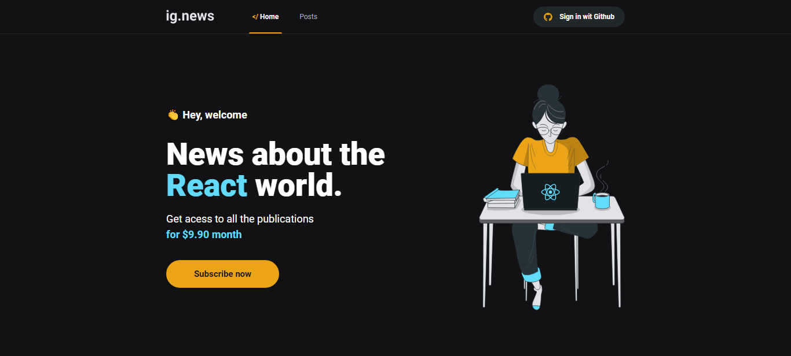

<h1 align="center">
  
</h1>

 

## 📌 | Technologies

This project was developed with the following technologies:

- [Next.js](https://nextjs.org/)
- [TypeScript](https://www.typescriptlang.org/)
- [Sass](https://sass-lang.com/)
- [Stripe](https://stripe.com/br)

API of stripe was used for create payment method.

## 🚧 | Project in building... | 🚧

This project is about newsletter platform, and your specialty content is about React.

 

  

